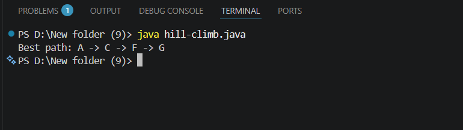

# Hill Climbing Algorithm

##  Aim
To implement the **Hill Climbing algorithm** to find an optimal solution by iteratively moving towards a better state using heuristic values.

---

##  Algorithm

1. Start with an **initial state**
2. Evaluate the **heuristic value** of the current state
3. Repeat until goal is reached or no better state exists:
   - Generate all **neighboring states**
   - Select the neighbor with the **lowest heuristic value**
   - If selected neighbor is **better** → move to that neighbor
   - Else → **Stop** (local optimum reached)
4. If goal state reached → return **success**
5. Otherwise → **terminate**

---

##  Code

[`programs/hillclimb.java`](programs/hillclimb.java)

---

##  Output

---

##  Result
The **Hill Climbing algorithm** was successfully implemented and the best path from the **start node** to the **goal node** was obtained using heuristic values.
