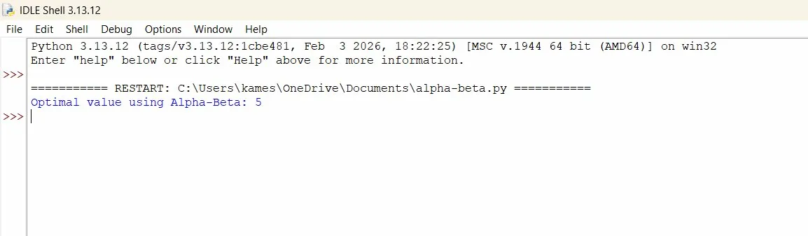

# Alpha-Beta Pruning Algorithm

##  Aim
To implement the **Alpha-Beta Pruning algorithm** to optimize the Minimax algorithm by eliminating unnecessary nodes and improving efficiency.

---

##  Algorithm

1. Start with the **root node**
2. Initialize: `alpha = -∞` (best for MAX), `beta = +∞` (best for MIN)
3. If **terminal node** → return its value
4. If **MAX node**:
   - Initialize `best = -∞`
   - For each child: compute value recursively
   - Update `best = max(best, value)`, `alpha = max(alpha, best)`
   - If `beta ≤ alpha` → **prune** remaining branches
5. If **MIN node**:
   - Initialize `best = +∞`
   - For each child: compute value recursively
   - Update `best = min(best, value)`, `beta = min(beta, best)`
   - If `beta ≤ alpha` → **prune** remaining branches
6. Return the **best value**

---

##  Code

[`programs/alpha-beta.py`](programs/alpha-beta.py)

---

##  Output

---

##  Result
The **Alpha-Beta Pruning algorithm** was successfully implemented and the optimal value was obtained efficiently by pruning unnecessary branches.
