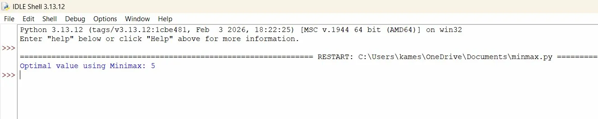

# Minimax Algorithm

##  Aim
To implement the **Minimax algorithm** to find the optimal move in a game by minimizing the possible loss and maximizing the possible gain.

---

##  Algorithm

1. Start from the **root node** (initial state)
2. If the node is a **terminal node** → return its value
3. If the node is a **MAX node** → select the **maximum** value from its children
4. If the node is a **MIN node** → select the **minimum** value from its children
5. **Recursively** apply the above steps until reaching leaf nodes
6. **Propagate values upward** to determine the optimal decision
7. Return the **optimal value** at the root node

---

##  Code

[`programs/minmax.py`](programs/minmax.py)

---

##  Output

---

##  Result
The **Minimax algorithm** was successfully implemented and the optimal value for the given game tree was determined.
