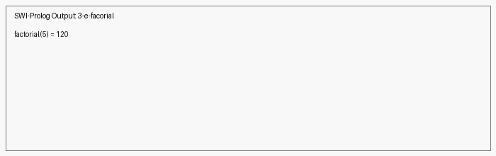

#  Factorial in Prolog

## Aim
To implement the **factorial function** using **first-order logic** in Prolog.

---

## Algorithm

1. **Base case**
   - `factorial(0, 1)`

2. **Recursive case**
   - For `N > 0`

3. **Decrease by 1**
   - `N1 = N - 1`

4. **Recursive call**
   - `factorial(N1, R1)`

5. **Multiply result**
   - `Result = N * R1`

6. **Return result**
   - Output the computed factorial.

---

## Code
[`factorial.pl`](programs/factorial.pl)

---

## Output

---

## Result
The **factorial function** was successfully implemented in Prolog using recursion and first-order logic, producing correct results for given inputs.
