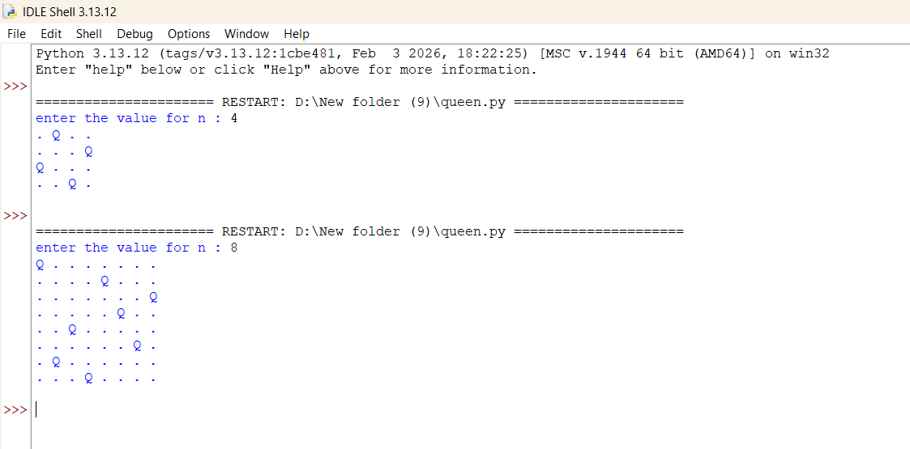

# N-Queens Problem — Backtracking Algorithm

## Aim
To solve the **N-Queens problem** using the Backtracking algorithm and place N queens on an N×N chessboard such that no two queens attack each other.

---

## Algorithm

1. Start with an **empty chessboard**
2. Place a queen in the **first row**
3. For each column in the current row:
   - Check if placing a queen is **safe**
   - If safe → **place the queen**
   - Recursively place queens in the **next row**
   - If placing fails → **backtrack** and remove the queen
4. Repeat until **all queens are placed**
5. If all queens placed successfully → **print the solution**

---

## Code

[`programs/queen.py`](programs/queen.py)

---

## Output



---

## One Possible Solution (8-Queens)

```
Q . . . . . . .
. . . . Q . . .
. . . . . . . Q
. . . . . Q . .
. . Q . . . . .
. . . . . . Q .
. Q . . . . . .
. . . Q . . . .
```

---

## Result
The **N-Queens problem** was successfully solved using the Backtracking algorithm, and a valid arrangement of queens was obtained such that no two queens attack each other.
