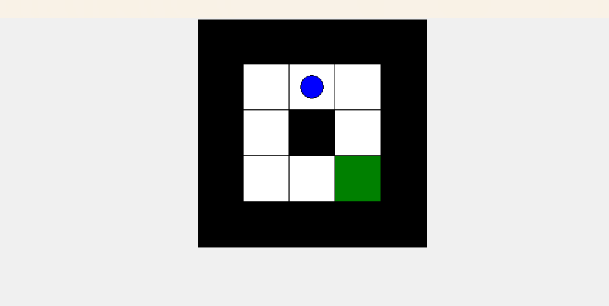

# Multi-Agent System — Maze Navigation (GUI)

##  Aim
To simulate a player navigating a maze using **arrow keys** in a GUI environment.

---

##  Algorithm

1. Define maze using a **2D list** (`1` = wall, `0` = path); import `tkinter`, `messagebox`
2. Set constraints — **cell size**, **start position**, **end position**
3. Create GUI with `tk.Canvas` using `tkinter`
4. Draw maze with **walls** (filled) and **paths** (empty)
5. Draw **player** as a blue circle at the start position
6. Handle **key presses**:
   - Move player if the new cell is a valid path
   - If player reaches the **goal** → show success message and exit

---

##  Code

[`programs/maze.py`](programs/maze.py)

---

##  Output

---

##  Result
The **multi-agent system** for maze navigation was successfully developed using a GUI environment. The player was able to navigate through the maze using arrow keys, and upon reaching the goal position, a **success message** was displayed.
