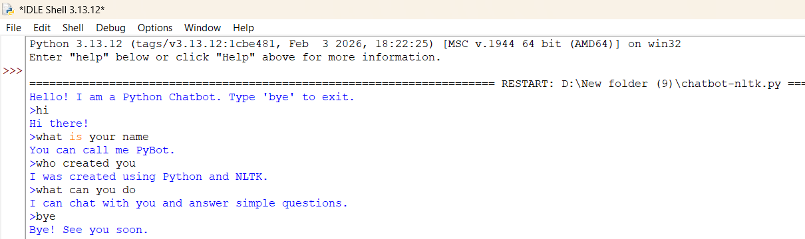
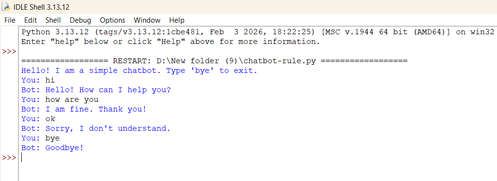
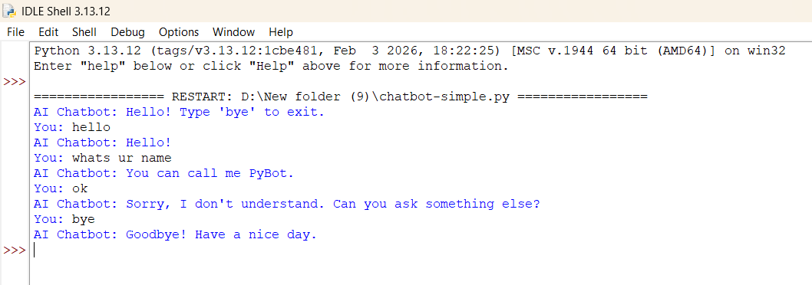

# Chatbot Implementation

## Aim
To design and implement a simple chatbot using Python that interacts with users and responds to basic queries using rule-based and pattern-matching techniques.

---

## Repository Structure

```

exp8/chatbot-app/
|-- programs/
|   |-- chatbot-nltk.py
|   |-- chatbot-rule.py
|   `-- chatbot-simple.py
`-- output-images/
   |-- chatbot-nltk.png
   |-- chatbot-rule.png
   `-- chatbot-simple.png

```

---

## Description

This repository contains three types of chatbot implementations:

1. NLTK-based chatbot (pattern matching using NLP library)
2. Rule-based chatbot (if-else conditions)
3. Keyword-based chatbot (custom logic without external libraries)

---

## Algorithm

1. Start the program  
2. Display a welcome message  
3. Accept user input  
4. Convert input to lowercase  
5. Match input with predefined patterns:
   - If input is a greeting → respond with greeting  
   - If input matches known questions → return predefined response  
   - If input contains keywords → return related response  
6. If no match found → display default message  
7. Repeat until user enters `bye`, `exit`, or `quit`  
8. End the program  

---

## How to Run

### Run NLTK Chatbot
```

pip install nltk
python programs/chatbot-nltk.py

```

### Run Rule-based Chatbot
```

python programs/chatbot-rule.py

```

### Run Simple Chatbot
```

python programs/chatbot-simple.py

```

---

## Code

- [`programs/chatbot-nltk.py`](programs/chatbot-nltk.py)
- [`programs/chatbot-rule.py`](programs/chatbot-rule.py)
- [`programs/chatbot-simple.py`](programs/chatbot-simple.py)

---

## Output





---

## Sample Output

```

Hello! I am a Python Chatbot. Type 'bye' to exit.

You: hi
Bot: Hello!

You: what is your name
Bot: I am a Python chatbot.

You: how are you
Bot: I am fine. Thank you!

You: help me
Bot: Sure! Tell me how I can help you.

You: bye
Bot: Goodbye! Have a nice day.

```

---

## Result

A simple chatbot system was successfully implemented using Python. The chatbot interacts with the user, processes input, and provides appropriate responses based on predefined rules and pattern matching techniques.

